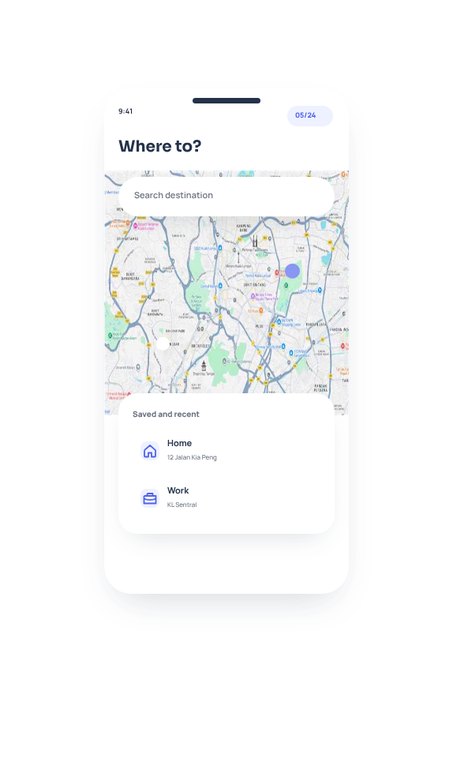
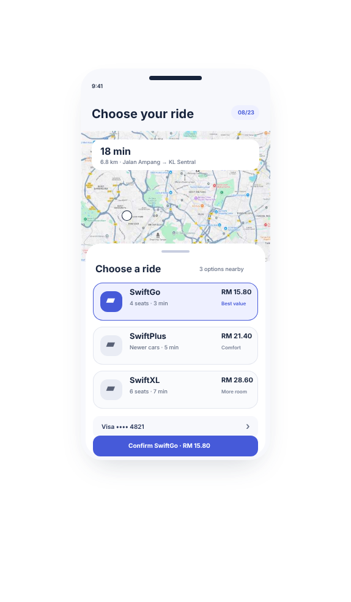
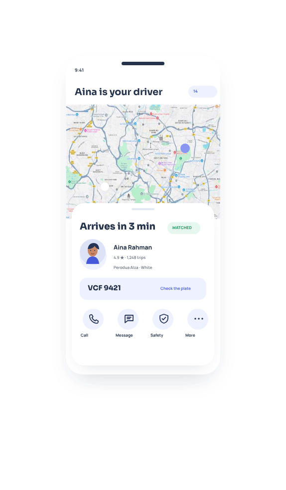
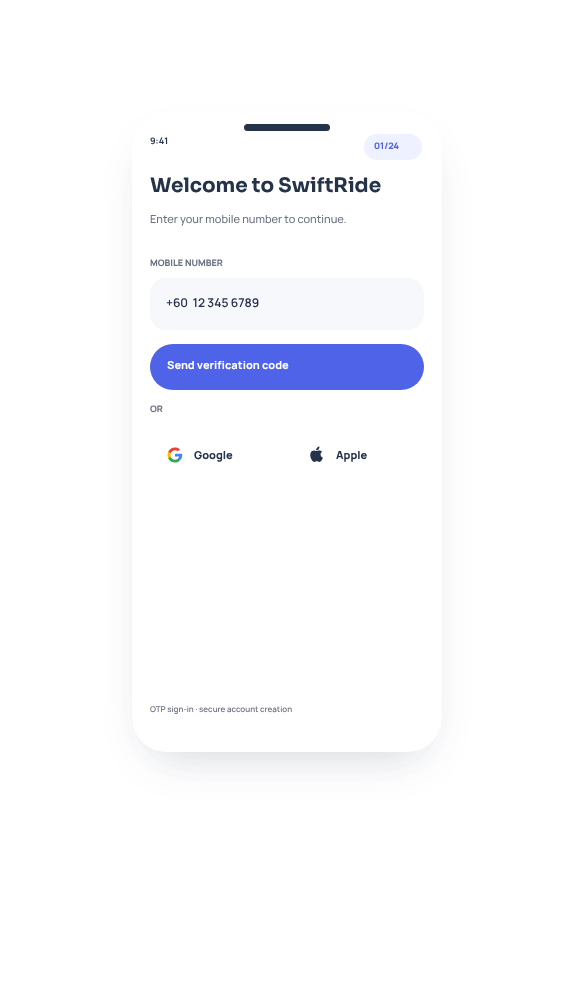
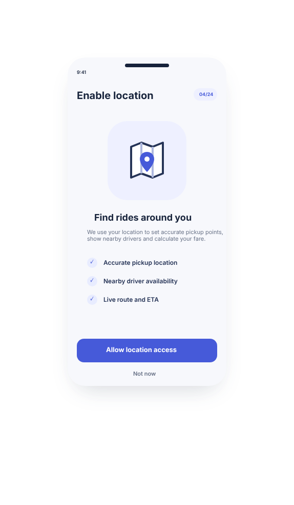
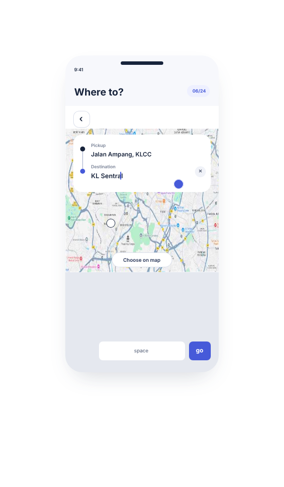
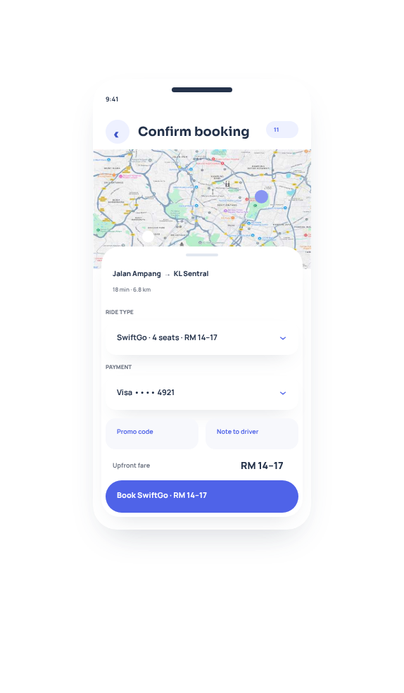
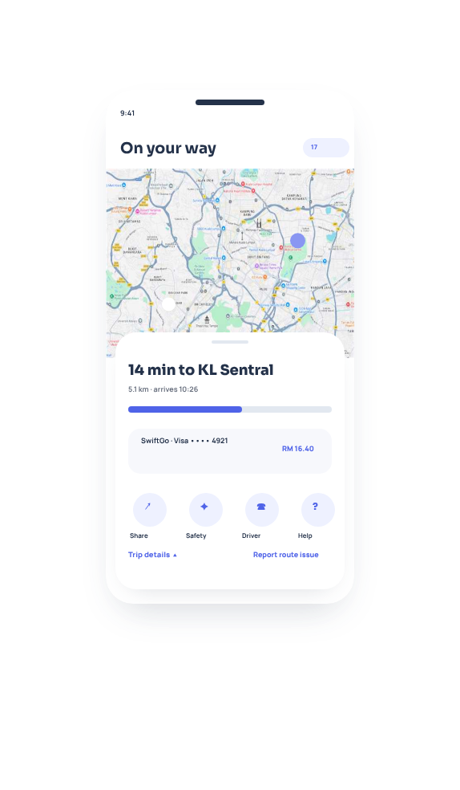
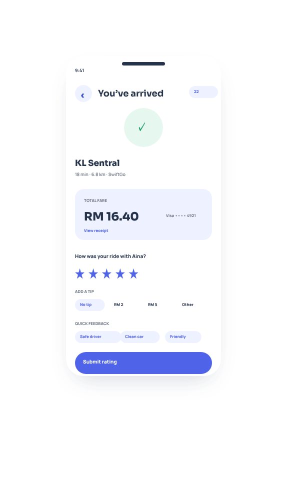

<div align="center">

# SwiftRide

### A calmer, clearer way to move through the city.

SwiftRide is a design-led ride-hailing experience for Kuala Lumpur. It brings the complete Rider journey—from the first location permission to the final trip review—into one focused, reassuring mobile experience.

[](https://flutter.dev/)
[](https://dart.dev/)
[](https://riverpod.dev/)
[](#quality)

</div>

<p align="center">
  
  &nbsp;
  
  &nbsp;
  
</p>

## The story

Ride-hailing is usually treated as a logistics problem: choose a point, find a car, reach a destination. For the person waiting at the kerb, however, it is also a trust problem.

**Is the pickup point correct? Which car should I enter? What happens if no driver accepts? Can someone follow my route? What will cancellation cost?**

SwiftRide began with the idea that these questions should be answered by the interface before the rider has to ask them. The product uses clear route context, upfront fare information, visible safety actions, verified driver identity, pickup-code protection and honest system states to make every stage feel understandable.

The visual language is intentionally restrained: cobalt communicates action and movement, deep slate carries trust-critical information, and quiet off-white surfaces keep maps and decisions readable. The experience takes interaction-flow inspiration from leading mobility products while retaining its own identity, typography and component system.

## Product experience

### 1. Enter with confidence

The journey starts with a focused sign-in screen: riders can continue with a mobile number or use the familiar Google and Apple entry points. Once signed in, SwiftRide explains how location access improves pickup accuracy, nearby-driver visibility and live arrival estimates before asking for permission.

<p align="center">
  
  &nbsp;&nbsp;
  
</p>

### 2. Plan without losing context

The home view immediately establishes the rider's current location and nearby cars. Destination search stays on the map, so riders can type an address, review pickup and drop-off points, or choose directly from the map without losing spatial context.

<p align="center">
  
  &nbsp;&nbsp;
  
</p>

### 3. Compare once, then confirm

After a destination is selected, route context and ride choices appear together. Riders can compare capacity, arrival time and fare, then review the selected ride, payment method, promo code and driver note before sending the request.

<p align="center">
  
  &nbsp;&nbsp;
  
</p>

### 4. Know who is coming

A successful match is presented as a trust checkpoint. The rider sees Aina's profile, rating, completed-trip count, vehicle, licence plate and arrival estimate, with direct access to calling, messaging and safety tools before entering the car.

<p align="center">
  
</p>

### 5. Stay informed through arrival

During the ride, the map and progress card keep the remaining time, destination, distance, fare and payment method visible. Sharing, safety, driver contact and route-issue reporting remain within one tap. Arrival then closes the journey with a receipt, rating, tip and quick feedback.

<p align="center">
  
  &nbsp;&nbsp;
  
</p>

## Rider capabilities

- Phone OTP authentication with invalid and expired-code recovery.
- Google and Apple sign-in entry points.
- Explained location permission and GPS reconnect states.
- Map-first pickup and destination input.
- Saved Home and Work locations.
- Pickup pin adjustment and route review.
- Inline SwiftGo, SwiftPlus and SwiftXL comparison.
- Expandable payment selection and upfront fare confirmation.
- Driver search, no-driver recovery and automatic matching transition.
- Verified driver profile, vehicle, plate and pickup-code protection.
- Approaching, arrived, waiting and active-trip states.
- Trip sharing, emergency assistance, audio recording and issue reporting.
- Transparent cancellation reasons, fee guidance and waiver conditions.
- Receipt, rating, tipping, feedback and trip history.

## Design source of truth

The interface was designed in **Penpot** and implemented in Flutter using the same Rider journey, content hierarchy and design tokens. The images in this README are direct exports from the current `SwiftRide V2` Penpot file—not recreated marketing mockups.

| Token | Value | Purpose |
| --- | --- | --- |
| Primary | `#465AD9` | Primary actions, selected states and route emphasis |
| Ink | `#17233B` | High-emphasis text and identity-critical information |
| Slate | `#263457` | Secondary dark surfaces and iconography |
| Background | `#F7F8FC` | Calm application canvas |
| Primary subtle | `#EEF0FF` | Selected cards, chips and supporting surfaces |
| Success | `#28A66A` | Arrival, connectivity and positive status |
| Typeface | Inter | Clear, compact mobile hierarchy |

## Engineering approach

SwiftRide uses a **feature-first clean architecture**. Product state is independent from widget lifecycle, and presentation code dispatches intentions instead of directly mutating booking data.

```text
lib/
├── app.dart
├── main.dart
├── core/
│   └── theme/
│       ├── app_colors.dart
│       └── app_theme.dart
└── features/
    └── rider/
        ├── domain/
        │   ├── ride_option.dart
        │   └── rider_stage.dart
        ├── application/
        │   ├── rider_flow_controller.dart
        │   └── rider_flow_state.dart
        └── presentation/
            └── pages/
                └── rider_flow_page.dart
```

### State management

[Riverpod](https://riverpod.dev/) is the single source of truth for:

- Rider navigation history.
- OTP entry and validation states.
- Vehicle and payment selections.
- Matching timers and lifecycle transitions.
- Trip sharing, rating and tipping state.

`RiderFlowState` is immutable, while `RiderFlowController` owns transitions and asynchronous matching behavior. This keeps business decisions testable without rendering Flutter widgets.

### Current scope

This repository currently contains the **Rider application only**. Driver and operations products remain in the broader SwiftRide design system but are intentionally outside this implementation milestone.

The current release is a high-fidelity functional prototype. Authentication, booking, map, payment and notification behavior are represented through deterministic local state. Production API integrations are documented in the roadmap below and are not presented as complete.

## Getting started

### Requirements

- Flutter `3.32.x` or compatible stable release.
- Dart `3.8.x` or compatible SDK.
- Android Studio, Xcode, Chrome or another Flutter-supported target.

### Run locally

```bash
git clone https://github.com/SaimonKabirChowdhury/SwiftRide.git
cd SwiftRide
flutter pub get
flutter run
```

Choose a target when Flutter prompts, or specify one directly:

```bash
flutter run -d chrome
flutter run -d android
flutter run -d ios
```

## Quality

The repository includes application-state tests, an authentication smoke test and a render pass across every Rider stage at the Penpot-aligned `430 × 900` viewport.

```bash
flutter analyze
flutter test
flutter build web --release
```

Verified for this release:

- Static analysis: **no issues**.
- Automated tests: **all passing**.
- Rider render coverage: **23/23 states**.
- Release web compilation: **successful**.

## Roadmap

- [ ] Live phone, Google and Apple authentication.
- [ ] Google Maps SDK, Places autocomplete and route geometry.
- [ ] Real-time driver discovery and booking backend.
- [ ] Push notifications and foreground trip updates.
- [ ] PCI-compliant card and wallet payment integration.
- [ ] Trusted-contact live trip sharing.
- [ ] Production safety escalation and audit logging.
- [ ] Accessibility audit, localization and dynamic type validation.
- [ ] Driver application implementation.
- [ ] Operations control tower implementation.

## Project status

SwiftRide is under active development. The design system and complete Rider product journey are established; the current engineering milestone focuses on turning that journey into a maintainable Flutter foundation before live mobility services are connected.

---

<div align="center">

Designed in Penpot. Built with Flutter. Structured for the road ahead.

</div>
